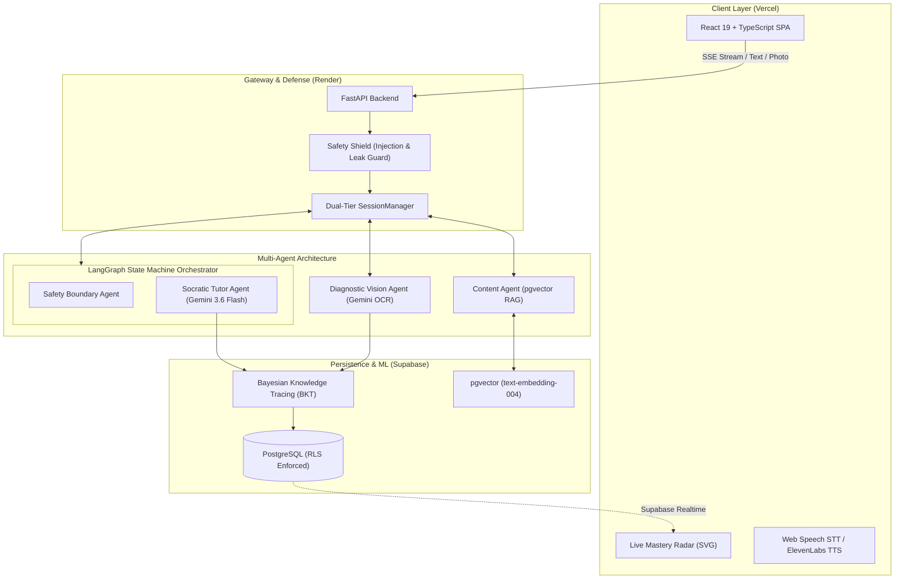

# Veritas — AI Socratic Math Tutor 🎓

> **Never gives away the answer.** Veritas diagnoses *why* a student's reasoning broke, pinpoints misconceptions on handwritten work with visual bounding boxes, and adapts what it teaches next using a calibrated **Bayesian Knowledge Tracing (BKT)** model.

[](https://fastapi.tiangolo.com/)
[](https://www.langchain.com/langgraph)
[](https://ai.google.dev/)
[](https://supabase.com/)
[](#machine-learning-pedagogical-engine)
[](#automated-validation-suite)

---

## 🎯 The Problem Veritas Solves

- **LLMs as "Cheat Machines"**: Generative AI tools (ChatGPT, Claude) default to dumping full calculations and final answers, bypassing the critical struggle where actual mathematical comprehension happens.
- **Multiple-Choice EdTech Blindness**: Traditional homework portals only record binary right/wrong answers without diagnosing *which* conceptual step failed or *why* the student believed their answer was right.
- **Parent & Teacher Disconnect**: Parents rarely know their child has a fraction gap until a failing test grade arrives weeks later.

### The Veritas Solution
Veritas delivers a private 1-on-1 human tutor experience:
1. **Strict Socratic Enforcement**: Multi-layered guardrails actively block answer leakage, guiding students with targeted probing questions.
2. **Handwritten Scratchpad Diagnosis**: Students upload camera photos of their handwritten math. Gemini 3.6 Flash detects the exact error step, generates visual bounding hints, and identifies the underlying misconception.
3. **Calibrated Student Mastery Model**: Updates per-skill mastery in real-time via Bayesian Knowledge Tracing calibrated against large-scale educational datasets.
4. **Live Parent Radar**: Parents track their child's curriculum competencies live with automated inactivity alerts.

---

## 🏗️ System Architecture



> **Multi-Agent Orchestration Note**: The Socratic Tutor and Safety-boundary agents are orchestrated via a compiled **LangGraph state machine** (`/session/message`), delivering state-driven dynamic routing, safety interception, and conversation history management. The Diagnostic Vision Agent (`/session/upload-work`) and Content Agent (`/session/next-problem`) are invoked directly for specialized multimodal vision breakdown and pgvector curriculum progression.

---

## 🧠 Machine Learning & Pedagogical Engine

### 1. Bayesian Knowledge Tracing (BKT)
Rather than simple streak counters, Veritas maintains a probabilistic cognitive model $P(L_t)$ tracking each student's latent mastery across 10 Common Core State Standards (CCSS):

$$\begin{aligned}
P(L_{t-1} \mid \text{Obs}) &= \begin{cases} 
\frac{P(L_{t-1})(1 - P(S))}{P(L_{t-1})(1 - P(S)) + (1 - P(L_{t-1}))P(G)} & \text{if correct} \\[8pt]
\frac{P(L_{t-1})P(S)}{P(L_{t-1})P(S) + (1 - P(L_{t-1}))(1 - P(G))} & \text{if incorrect}
\end{cases} \\[10pt]
P(L_t) &= P(L_{t-1} \mid \text{Obs}) + (1 - P(L_{t-1} \mid \text{Obs})) \cdot P(T)
\end{aligned}$$

- **Calibrated Parameters**: Calibrated on the ASSISTments benchmark dataset across ~2.7M student problem interactions. 6 of 10 CCSS skills are empirically fitted via Maximum Likelihood Estimation (MLE); the remaining 4 skills utilize Corbett & Anderson (1995) baseline cognitive tutor priors until real interaction volume scales (fully registered in `backend/bkt/parameters.json`).
- **Parameters**: Prior $P(L_0)$, Transition $P(T)$, Guess $P(G)$, and Slip $P(S)$ configured in `backend/bkt/parameters.json`.

### 2. Multimodal Diagnostic Vision Agent
- **Visual Error Localization**: Inspects handwritten math work, extracts steps via OCR, and maps mistakes to research-backed misconception taxonomies (Eedi / NeurIPS 2020).
- **Bounding Coordinates**: Returns normalized coordinate bounding boxes highlighting the exact error location for student feedback.

### 3. Misconception-Targeted RAG (pgvector)
- Embeds diagnosed misconceptions using `models/gemini-embedding-001` (768 dimensions).
- Uses vector cosine similarity inside Supabase PostgreSQL (`match_problems` RPC) to retrieve the pedagogical problem best suited to close that specific gap.

---

## 📚 Data Provenance & Open-Source Citations

Veritas leverages established academic benchmarks and open-source datasets to train, calibrate, and seed its pedagogical systems. In full compliance with academic integrity and open-source licenses:

| Resource / Dataset | License | Citation / Source | Role in Veritas |
|---|---|---|---|
| **GSM8K** (Grade School Math 8K) | **[MIT License](https://github.com/openai/grade-school-math/blob/master/LICENSE)** | OpenAI (Cobbe et al., *Training Verifiers to Solve Math Word Problems*, 2021) | **60 multi-step math word problems** imported via `scripts/expand_problem_bank.py`, re-tagged to CCSS Grade 3–5 skill standards, and structured with pedagogical reasoning steps in `data/seed_problems.json`. |
| **ASSISTments 2009–2010** | Open Academic / CAHLR | Worcester Polytechnic Institute (Heffernan et al.) | **Empirical BKT Calibration**: MLE parameter fitting ($P(L_0)$, $P(T)$, $P(G)$, $P(S)$) across 6 core skills over ~2.7M student interaction logs (`backend/bkt/parameters.json`). |
| **Eedi / NeurIPS 2020** | CC BY-NC-SA 4.0 | Eedi & Microsoft Research (Wang et al., *Diagnostic Questions*, 2020) | **Diagnostic Error Taxonomy**: Misconception classification ontology used by the Gemini Vision diagnostic agent to pinpoint root causes behind erroneous handwritten work. |
| **CCSS-M** | Public Domain | National Governors Association / CCSSO | **Curriculum Hierarchy**: Common Core State Standards for Grade 3–5 Mathematics structuring skill mastery ordering and progression. |

---

## ⚡ Core Features

| Feature | Description |
|---|---|
| 🎙️ **Voice-First Socratic Chat** | Low-latency streaming SSE dialogue with ElevenLabs TTS proxy and Web Speech STT. |
| 📸 **Scratchpad Work Vision** | Upload camera photos of handwritten calculations for step-by-step diagnostic breakdown. |
| 🛡️ **Anti-Leak Guardrails** | Secondary verification intercepts direct final answer reveals, redirecting to foundational questions. |
| 📊 **Real-Time Parent Radar** | 10-skill CCSS radar chart syncing live learning events via Supabase Realtime. |
| 💾 **Dual-Tier State Resilience** | Active sessions are cached in RAM (0ms) and backed by Supabase `sessions.state` JSONB + event streams (survives container redeploys). |
| 🔒 **Enterprise RLS Security** | Strict Supabase Row Level Security ensures parents cannot access another family's child records. |
| 🗑️ **Parental Data Deletion** | Self-serve "Delete Activity Data" control to immediately purge logs and session histories. |
| 🤖 **Neo Platform Assistant** | In-app contextual AI companion grounded to explain platform pedagogy and help parents navigate. |

---

## ✅ Automated Validation Suite

Veritas features an automated test runner verifying safety, RLS isolation, session survival, and multi-agent coordination.

Run the entire suite locally in ~23 seconds:
```bash
python backend/run_all_tests.py
```

### Live Test Suite Output
```text
============================================================================
   VERITAS AI SOCRATIC TUTOR — AUTOMATED VALIDATION SUITE
============================================================================

▶ Running Day-3 Resiliency & Session Persistence (test_session_persistence.py)...
  ✓ Day-3 Resiliency & Session Persistence passed in 17.87s

▶ Running Production RLS & Credential Isolation (test_production_rls.py)...
  ✓ Production RLS & Credential Isolation passed in 4.62s

▶ Running Platform Safety & Socratic Guardrails (test_safety.py)...
  ✓ Platform Safety & Socratic Guardrails passed in 0.54s

▶ Running Student Scoping, Rate Limiting & RAG Retrieval (test_auth_and_rag.py)...
  ✓ Student Scoping, Rate Limiting & RAG Retrieval passed in 8.82s

▶ Running Parent-Child Architecture & Inactivity Alerts (test_parent_child_flow.py)...
  ✓ Parent-Child Architecture & Inactivity Alerts passed in 21.97s

▶ Running Neo AI Platform Assistant & Guardrails (test_neo.py)...
  ✓ Neo AI Platform Assistant & Guardrails passed in 16.11s

============================================================================
                      DEMO DAY TEST EXECUTION SUMMARY                       
============================================================================
 #  | TEST SUITE                                      | STATUS     |    TIME
----------------------------------------------------------------------------
 1  | Day-3 Resiliency & Session Persistence          | ✓ PASS     |  17.87s
 2  | Production RLS & Credential Isolation           | ✓ PASS     |   4.62s
 3  | Platform Safety & Socratic Guardrails           | ✓ PASS     |   0.54s
 4  | Student Scoping, Rate Limiting & RAG Retrieval  | ✓ PASS     |   8.82s
 5  | Parent-Child Architecture & Inactivity Alerts   | ✓ PASS     |  21.97s
 6  | Neo AI Platform Assistant & Guardrails          | ✓ PASS     |  16.11s
----------------------------------------------------------------------------
  ALL 6/6 TEST SUITES PASSED IN 69.92s!
  STATUS: 100% PRODUCTION READY & DEMO-DAY BULLETPROOF
============================================================================
```

---

## 🚀 Quickstart

### Prerequisites
- Python 3.11+
- Node.js 18+
- Supabase account with pgvector enabled
- Google Gemini API key

### 1. Clone & Setup
```bash
git clone https://github.com/Susil-commits/AINerd.git
cd AINerd

# Install Frontend dependencies
cd frontend && npm install && cd ..

# Setup Python Virtual Environment
cd backend
python -m venv venv
.\venv\Scripts\activate   # Windows
# source venv/bin/activate  # macOS/Linux
pip install -r requirements.txt
cd ..
```

### 2. Environment Configuration
Create `.env` in `backend/` and `frontend/`:
```env
# backend/.env
GEMINI_API_KEY=your_gemini_api_key
SUPABASE_URL=https://your-project.supabase.co
SUPABASE_ANON_KEY=your_supabase_anon_key
SUPABASE_SERVICE_ROLE_KEY=your_supabase_service_role_key
SUPABASE_JWT_SECRET=your_supabase_jwt_secret  # From Supabase Settings -> API -> JWT Settings
ELEVENLABS_API_KEY=your_elevenlabs_key  # Optional
```

```env
# frontend/.env
VITE_API_URL=http://localhost:8000
VITE_SUPABASE_URL=https://your-project.supabase.co
VITE_SUPABASE_ANON_KEY=your_supabase_anon_key
```

### 3. Database Migrations & Vector Seed
In your Supabase SQL Editor, run:
1. `scripts/setup_db.sql` (Tables, pgvector schema, RPCs)
2. `scripts/migration_day2_auth_children.sql` (Parent-child schema & strict RLS)
3. `scripts/migration_day3_session_state.sql` (Session state persistence)

Seed initial problem bank with Gemini embeddings:
```bash
python scripts/seed_db.py
```

### 4. Launch Locally
```bash
# Terminal 1 — Backend
cd backend
uvicorn main:app --reload --port 8000

# Terminal 2 — Frontend
cd frontend
npm run dev
```

---

## 📌 Known Limitations & Post-Hackathon Roadmap

- **Dependency Security Patches**: Backend dependencies are pinned to versions current as of initial build; a full security-patch upgrade is planned post-hackathon. (`python-multipart` has been patched to `0.0.32` to protect public multipart upload parsing).
- **Curriculum Scope**: Current problem bank targets 10 core Common Core State Standards (CCSS) in elementary mathematics, architected to expand to middle and high school standards.

