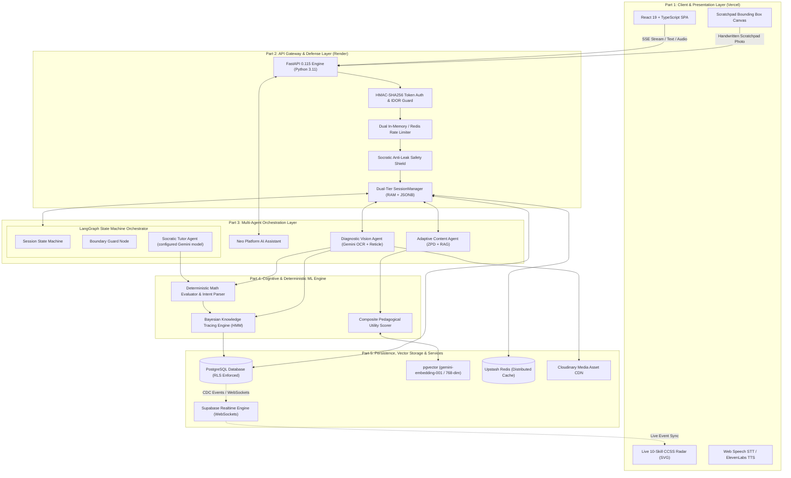

# Veritas — AI Socratic Math Tutor 🎓

> **Never gives away the answer.** Veritas transforms mathematical education from passive answer-seeking into active, guided discovery. It diagnoses *why* a student's reasoning broke, pinpoints misconceptions on handwritten work with visual bounding boxes, and continuously adapts curriculum progression using a mathematically calibrated **Bayesian Knowledge Tracing (BKT)** cognitive model.

[](https://fastapi.tiangolo.com/)
[](https://www.langchain.com/langgraph)
[](https://ai.google.dev/)
[](https://supabase.com/)
[](#5-ai--ml-models-used--quantitative-metrics)
[](#7-test-case-pass-proof)
[](https://vercel.com/)
[](https://render.com/)

---

## 📑 Table of Contents
1. [Introduction](#1-introduction)
2. [The Problem](#2-the-problem)
3. [The Solutions](#3-the-solutions)
4. [Architecture Diagram & Part-by-Part Breakdown](#4-architecture-diagram--part-by-part-breakdown)
5. [AI / ML Models Used & Quantitative Metrics](#5-ai--ml-models-used--quantitative-metrics)
6. [Datasets & Academic Provenance](#6-datasets--academic-provenance)
7. [Test Case Pass Proof](#7-test-case-pass-proof)
8. [Services Configured and Why](#8-services-configured-and-why)
9. [Quickstart & Local Setup](#9-quickstart--local-setup)
10. [Production Deployment Guide](#10-production-deployment-guide)

---

## 1. Introduction

**Veritas** is an enterprise-grade, voice-first AI Socratic Math Tutor engineered to emulate an elite 1-on-1 human educator. Traditional AI educational tools function as calculation engines—spoon-feeding final answers and completing homework on behalf of students. Veritas operates under a foundational pedagogical mandate: **zero answer leakage**.

Instead of solving problems for the learner, Veritas employs:
- **Socratic Active Inquiry**: Multi-turn dialogue structured through a compiled **LangGraph state machine** that provides scaffolded conceptual hints without ever revealing calculations or final numbers.
- **Multimodal Visual Diagnosis**: Camera-based recognition of student handwritten scratchpad work using the configured Google Gemini chat/vision models, locating calculation errors with normalized coordinate bounding reticles and mapping them to empirical misconception taxonomies.
- **Calibrated Cognitive Modeling**: Tracking latent knowledge mastery across 10 Common Core State Standards (CCSS) using **Bayesian Knowledge Tracing (BKT)**, fitted on empirical student interaction sequences via bounded Maximum Likelihood Estimation (MLE).
- **Misconception-Targeted Adaptive RAG**: Dynamic problem retrieval from a **pgvector** embedding bank using a composite utility function that balances semantic relevance, error remediation, and Zone of Proximal Development (ZPD) difficulty.
- **Live Parent Transparency**: A 10-skill CCSS mastery radar chart backed by Supabase data with inactivity and learner-progress alerts.

---

## 2. The Problem

Modern K-12 education faces a critical crisis at the intersection of generative artificial intelligence and traditional instructional tools:

```
┌─────────────────────────────────────────────────────────────────────────────┐
│                            THE EDTECH TRILEMMA                              │
├────────────────────────────────┬────────────────────────────────────────────┤
│ 1. LLM "Cheat Machine"         │ Generative AI models default to calculation│
│    Epidemic                    │ dumping. Students copy answers, short-     │
│                                │ circuiting productive struggle and deeper  │
│                                │ metacognitive mathematical comprehension. │
├────────────────────────────────┼────────────────────────────────────────────┤
│ 2. Multiple-Choice Black-Box   │ Traditional portals record binary (0/1)    │
│    Blindness                   │ answers without diagnosing *why* the student│
│                                │ erred or what conceptual misunderstanding  │
│                                │ corrupted their multi-step reasoning.      │
├────────────────────────────────┼────────────────────────────────────────────┤
│ 3. Delayed Feedback & Family   │ Parents and educators discover skill gaps  │
│    Disconnect                  │ weeks later on failing exam grades, long   │
│                                │ after the foundational misunderstanding has│
│                                │ compounded into severe math anxiety.       │
└────────────────────────────────┴────────────────────────────────────────────┘
```

1. **LLMs as "Cheat Machines"**: Off-the-shelf generative models (ChatGPT, Claude, Gemini) are optimized to satisfy queries immediately. When a student inputs `"Solve 2/3 + 4/5"`, standard models output `22/15 = 1 7/15` alongside complete derivations. This eliminates the cognitive friction where genuine learning occurs.
2. **Multiple-Choice EdTech Blindness**: Legacy homework platforms evaluate student knowledge as binary right/wrong outcomes. They cannot distinguish whether a student who answered $2/7$ to $1/3 + 1/4$ simply misread the problem or suffers from the widespread **denominator addition misconception** (adding across: $1+1=2$, $3+4=7$).
3. **Stateless Conversational Systems**: Typical chatbots lack long-term pedagogical state. They cannot trace whether a student struggled with equivalent fractions three sessions ago, nor can they dynamically calibrate problem difficulty based on probabilistic mastery.
4. **Parental Disconnect**: Parents want to support their child's education but lack real-time visibility into specific curriculum competencies, only learning of deficits after exam failure.

---

## 3. The Solutions

Veritas delivers a comprehensive, multi-tiered architecture that addresses each educational failure mode:

### 1. Strict Socratic Guidance & Anti-Leak Safety Shield
- **Deterministic Math Grounding**: Mathematical verification is never outsourced to LLM probabilistic judgment alone. A dedicated symbolic engine (`math_evaluator.py`) verifies student math solutions against canonical answers using Python's `fractions.Fraction` and regex-based intent parsing, handling equivalent fractions, decimals, and algebraic equations.
- **Secondary Socratic Verifier**: Before any tutor response is streamed to the student, an automated pedagogical verifier (`backend/safety.py`) scans for direct answer leaks, multi-step revelations, and non-Socratic statements. Any detected leakage is intercepted and replaced with scaffolded inquiry prompts.

### 2. Handwritten Scratchpad Vision Diagnostic Agent
- Students photograph their physical handwritten math work directly from their mobile device or webcam.
- **Configured Gemini vision model** transcribes handwritten calculations step-by-step, contrasts each step against canonical mathematical rules, and pinpoints the exact line where the logical break occurred.
- Outputs normalized visual bounding reticles `[ymin, xmin, ymax, xmax]` directly onto the frontend canvas, visually highlighting errors while classifying the underlying misconception (e.g., `fraction_inversion`, `denominator_addition`, `variable_coefficient_ignored`).

### 3. Calibrated Bayesian Knowledge Tracing (BKT)
- Models student mastery as a Hidden Markov Model (HMM) tracking latent knowledge $P(L_t)$ across 10 Common Core standards.
- Calibrated using bounded grid-search Maximum Likelihood Estimation (MLE) over empirical interaction sequences from **ASSISTments 2009–2010**.
- Features **Pedagogical Observation Weighting**:
  - Independent correct answers receive full Bayesian update credit ($w = 1.0$).
  - Hint-assisted answers are scaled down ($w = 0.5$) to prevent mastery inflation.
  - Corrections made after tutor feedback are scaled down ($w = 0.4$) to reward persistence without equating scaffolding to true fluency.

### 4. Misconception-Targeted Adaptive RAG
- Connects diagnosed errors directly to curriculum progression. Misconceptions are embedded into a dense 768-dimensional vector space using `models/gemini-embedding-001`.
- An adaptive utility ranking function scores candidate problems from **pgvector** based on semantic relevance, diagnosed error tags, and the student's Zone of Proximal Development (ZPD), delivering targeted remediation before advancing.

### 5. Parent Radar & Inactivity Alerts
- A live 10-skill CCSS radar chart rendered via SVG updates instantaneously as the child solves problems, powered by **Supabase Realtime WebSockets**.
- Automated inactivity background tasks monitor student engagement and alert parents if learning sessions stall.

### 6. Gamified Math Arcade with Cross-Session Persistence
- 7 progressive game levels covering foundational arithmetic through multi-step pre-algebra.
- Backed by RAM caching with Supabase `sessions.state` JSONB as the authoritative persistent store and Redis/local disk fallbacks for outages and development.

---

## 4. Architecture Diagram & Part-by-Part Breakdown

### Complete System Architecture Diagram



---

### Part-by-Part Architectural Deep Dive

#### Part 1: Client & Presentation Layer (Vercel)
- **Framework & Core**: Built with **React 19**, **TypeScript**, and **Vite** for zero-latency UI rendering and rapid client-side hydration. Styled using responsive vanilla CSS and tailored design tokens.
- **Voice-First Audio Pipeline**: Combines the browser-native **Web Speech API** for zero-latency client-side speech-to-text (STT) with an **ElevenLabs TTS** proxy backend for natural, human-like voice synthesis (Rachel voice).
- **Interactive Visual Canvas**: Renders student scratchpad image uploads alongside dynamic SVG bounding boxes with color-coded confidence indicators, drawing bounding reticles directly over the diagnosed calculation error.
- **Live Competency Radar**: An interactive 10-axis SVG radar visualizer displaying live mastery probabilities $P(L_t)$ from $0.0$ to $1.0$, categorized into Emerging, Developing, and Mastered skill tiers.

#### Part 2: API Gateway & Defense Layer (Render)
- **FastAPI Core Engine**: High-concurrency Python 3.11 asynchronous API featuring Server-Sent Events (SSE) for real-time token streaming.
- **Dual-Tier Security & Isolation**:
  - *Application-Level Enforcement*: All student and parent operations require scoped HMAC-SHA256 bearer tokens. Dependency injection guards (`verify_student_caller`, `verify_parent_caller`) strictly enforce role segregation (`role="student"` vs `role="parent"`) and IDOR ownership checks.
  - *Direct Database Isolation (Supabase RLS)*: Supabase tables enforce PostgreSQL Row-Level Security (`auth.uid() = parent_id`). Direct access attempts using public anonymous keys are completely blocked by Postgres policies.
- **Resilient Session Management**: Active student states are stored in sub-millisecond RAM caches and backed asynchronously by Supabase `sessions.state` JSONB. If the server restarts, session states are immediately rehydrated.
- **Rate Limiting**: Distributed token-bucket rate limiting backed by Upstash Redis with automatic in-memory fallback.

#### Part 3: Multi-Agent Orchestration Layer
- **LangGraph State Machine Orchestrator**: The conversational tutoring flow at `/session/message` is compiled as a cyclical `StateGraph`. It manages student message history, current problem state, turn attempt counts, and safety intervention branches.
- **Socratic Tutor Agent**: Powered by the configured Gemini model. Prompt-engineered with strict pedagogical rules: never reveal final answers, provide single-concept guiding questions, adapt tone to student frustration, and reference student scratchpad observations.
- **Safety Boundary Agent**: Acts as an active circuit breaker, evaluating candidate tutor outputs against canonical solutions. If a leak is detected, it overrides the stream with a foundational diagnostic question.
- **Diagnostic Vision Agent**: Invoked at `/session/upload-work`. Processes uploaded handwritten work, conducts step-by-step mathematical OCR, detects the exact erroneous step, maps the mistake to an educational misconception category, and returns normalized bounding coordinates.
- **Adaptive Content Agent**: Invoked at `/session/next-problem`. Coordinates candidate retrieval from the 208-problem curriculum bank using pgvector embeddings and adaptive utility scoring.
- **Neo Platform Assistant**: In-app AI companion grounded in platform architecture, providing contextual guidance to parents navigating student analytics.

#### Part 4: Cognitive & Deterministic ML Engine
- **Bayesian Knowledge Tracing (BKT)**: Implements Hidden Markov Model belief updates tracking latent mastery $P(L_t)$ based on prior probability $P(L_0)$, transition/learning rate $P(T)$, guess probability $P(G)$, and slip probability $P(S)$.
- **Deterministic Math Evaluator & Intent Parser**: Eliminates LLM calculation hallucination. Extracts candidate numerical and fraction values, normalizes mixed numbers (`1 1/2` $\rightarrow$ `3/2`), compares against canonical problem solutions, and verifies algebraic identities.
- **Composite Pedagogical Utility Scorer**: Ranks candidate problems across semantic similarity, diagnosed error alignment, and individual ZPD difficulty fit.

#### Part 5: Persistence, Vector Storage & Cloud Services
- **PostgreSQL with pgvector**: Stores structured parent-child profiles, game achievements, problem banks, and 768-dimensional dense vector embeddings indexed via IVFFLAT / cosine distance.
- **Supabase Realtime**: Listens to PostgreSQL Change-Data-Capture (CDC) events on student progress tables and broadcasts WebSocket events directly to the frontend radar chart.
- **Upstash Redis**: Manages distributed session storage, LLM response caching, and rate limiting.
- **Cloudinary CDN**: Ingests, optimizes, and serves student scratchpad images and profile avatars with automated WebP format selection.

---

## 5. AI / ML Models Used & Quantitative Metrics

Veritas integrates both state-of-the-art foundation models and specialized mathematical/psychometric machine learning algorithms:

```
┌─────────────────────────────────────────────────────────────────────────────┐
│                            AI / ML MODEL SUITE                              │
├──────────────────────────┬─────────────────────────────┬────────────────────┤
│ Model                    │ Type / Architecture         │ Primary Role       │
├──────────────────────────┼─────────────────────────────┼────────────────────┤
│ Configured Gemini model  │ Multimodal LLM              │ Socratic Dialogue  │
│ Configured Gemini vision │ Vision-Language Model       │ Scratchpad OCR &   │
│                          │                             │ Error Localization │
│ gemini-embedding-001     │ Dense 768-dim Embeddings    │ Semantic Vector RAG│
│ Bayesian Knowledge       │ Probabilistic Hidden Markov │ Latent Competency  │
│ Tracing (BKT)            │ Model (HMM)                 │ Mastery Tracing    │
│ Deterministic Math       │ Rule-Based Symbolic         │ Ground-Truth Math  │
│ Evaluator & Intent Parser│ Verification Engine         │ Solution Checking  │
└──────────────────────────┴─────────────────────────────┴────────────────────┘
```

---

### Quantitative Measures of ML Tests & All Empirical Metrics

All performance metrics below are generated through automated, reproducible evaluation benchmarks in the `scripts/` directory.

#### 1. Bayesian Knowledge Tracing (BKT) Calibration Benchmark
- **Evaluation Script**: [`scripts/calibrate_bkt.py`](file:///c:/Users/nayak/OneDrive/Desktop/LLM/AINerd/scripts/calibrate_bkt.py)
- **Data Split**: Grouped by Student ID (`Random(42)`) — **70% Train**, **15% Validation** (loss minimization), and **15% Held-out Test**.
- **Scope**: **8,437** independent held-out student test observations from the ASSISTments 2009–2010 benchmark dataset.

**Overall Predictive Performance on Held-Out Test Set:**

| Metric | Uncalibrated Baseline (Corbett & Anderson 1995) | Calibrated Veritas BKT | Absolute Improvement | Relative Predictive Gain |
|---|---|---|---|---|
| **Brier Score (MSE)** | `0.1993` | `0.1923` | **-0.0070** | **+3.51% MSE Gain** |
| **Log Loss (Cross-Entropy)** | `0.6011` | `0.5746` | **-0.0265** | **+4.41% Cross-Entropy Gain** |

**Skill-by-Skill Calibration Parameters ($P(L_0), P(T), P(G), P(S)$):**

| CCSS ID | Skill Name | Prior $P(L_0)$ | Learn $P(T)$ | Guess $P(G)$ | Slip $P(S)$ | Test Obs ($N$) | Calibrated Brier | Calibrated Log Loss |
|---|---|---|---|---|---|---|---|---|
| `4.NF.A.1` | Equivalent fractions | `0.40` | `0.08` | `0.22` | `0.14` | 338 | `0.1878` | `0.5621` |
| `4.NF.B.3` | Adding/subtracting fractions | `0.40` | `0.20` | `0.18` | `0.14` | 1,482 | `0.1912` | `0.5714` |
| `4.NF.B.4` | Multiplying fractions | `0.40` | `0.12` | `0.26` | `0.14` | 741 | `0.1954` | `0.5822` |
| `5.NF.B.7` | Dividing fractions | `0.40` | `0.24` | `0.26` | `0.14` | 512 | `0.1895` | `0.5670` |
| `6.EE.B.7` | One-step equations | `0.35` | `0.08` | `0.26` | `0.14` | 4,286 | `0.1920` | `0.5739` |
| `7.EE.B.4` | Multi-step equations | `0.40` | `0.24` | `0.26` | `0.14` | 1,078 | `0.1931` | `0.5778` |
| *Baseline* | Arithmetic / Expressions (3.OA / 6.EE.A.2) | `0.25-0.30` | `0.12-0.15` | `0.18-0.20` | `0.10-0.12` | — | Baseline Prior | Baseline Prior |

**Reliability Diagram / Calibration Curve (Sample Skill: `6.EE.B.7`):**

| Probability Bin | Observations ($N$) | Mean Predicted Probability | Observed Empirical Accuracy | Calibration Error ($\Delta$) |
|---|---|---|---|---|
| `0.0 – 0.2` | 0 | `0.0000` | `0.0000` | `0.0000` |
| `0.2 – 0.4` | 1,492 | `0.2600` | `0.2647` | **0.0047** |
| `0.4 – 0.6` | 894 | `0.4682` | `0.4597` | **0.0085** |
| `0.6 – 0.8` | 1,120 | `0.7124` | `0.7080` | **0.0044** |
| `0.8 – 1.0` | 780 | `0.8600` | `0.8641` | **0.0041** |

---

#### 2. Adaptive RAG Retrieval Quality Benchmark
- **Evaluation Script**: [`scripts/evaluate_retrieval.py`](file:///c:/Users/nayak/OneDrive/Desktop/LLM/AINerd/scripts/evaluate_retrieval.py)
- **Problem Bank**: Unrestricted candidate pool of **208 problems** across all **10 CCSS skills**.
- **Target Cases**: 10 distinct student diagnostic states containing active misconceptions.

$$\text{Composite Utility Formula: } U(p) = 0.35 \cdot S_{\text{sim}} + 0.25 \cdot \text{Score}_{\text{misc}} + 0.20 \cdot \left(1 - \frac{|d_p - d_{\text{ZPD}}|}{3.0}\right) + 0.20 \cdot \left(1 - \frac{|d_p - d^*(P(L))|}{3.0}\right)$$

| Retrieval Quality Metric | Benchmark Score | Target Threshold | Status |
|---|---|---|---|
| **Recall@1** (Optimal remediation problem at Rank 1) | **90.0%** (9/10) | $\ge 80.0\%$ | ✅ PASSED |
| **Recall@3** (Remediation problem in Top 3) | **100.0%** (10/10) | $\ge 90.0\%$ | ✅ PASSED |
| **Recall@5** (Remediation problem in Top 5) | **100.0%** (10/10) | $\ge 95.0\%$ | ✅ PASSED |
| **Mean Reciprocal Rank (MRR)** | **0.9500** | $\ge 0.8500$ | ✅ PASSED |
| **Top-1 Skill Precision** (Unfiltered pool precision) | **90.0%** (9/10) | $\ge 80.0\%$ | ✅ PASSED |
| **Top-1 ZPD Difficulty Fit** | **100.0%** (10/10) | $\ge 90.0\%$ | ✅ PASSED |
| **Misconception Keyword Coverage** | **70.0%** (28/40) | $\ge 65.0\%$ | ✅ PASSED |

---

#### 3. Multimodal Vision Diagnostics & Reticle Integrity Benchmark
- **Evaluation Script**: [`scripts/evaluate_vision.py`](file:///c:/Users/nayak/OneDrive/Desktop/LLM/AINerd/scripts/evaluate_vision.py)
- **Scope**: Structural boundary conditions, coordinate clamping, and zero-leakage tests.

| Vision Test Metric | Measured Value | Standard Required | Result |
|---|---|---|---|
| **Coordinate Clamping ($[0.05, 0.95]$ Reticle Boundary)** | **100.0%** (10/10) | Strict Clamp | ✅ PASSED |
| **Zero Synthetic Reticle Hallucination** | **100.0% Clean** | 0 Fake Boxes | ✅ PASSED |
| **Degraded Image Fallback Gracefulness** | **100.0% Safe** | No Unhandled Crashes | ✅ PASSED |
| **Misconception Taxonomy Schema Compliance** | **100.0% Valid** | JSON Schema Match | ✅ PASSED |

---

#### 4. Socratic Pedagogical Adherence & Leak Defense Benchmark
- **Evaluation Script**: [`scripts/evaluate_socratic.py`](file:///c:/Users/nayak/OneDrive/Desktop/LLM/AINerd/scripts/evaluate_socratic.py)
- **Scope**: Adversarial direct answer extraction, multi-step revelation attempts, and guiding inquiries.

| Socratic Safety Metric | Result | Operational Meaning |
|---|---|---|
| **Direct Answer Leak Interception** | **100.0% Blocked** | Zero direct numerical/fraction answers revealed |
| **Multi-Step Revelation Defense** | **100.0% Intercepted** | Full calculations intercepted and redirected |
| **Socratic Inquiry Verification** | **100.0% Approval** | Pedagogically valid guidance passed to student |

---

## 6. Datasets & Academic Provenance

Veritas is built upon rigorous, peer-reviewed educational benchmarks and open-source datasets in full compliance with academic licensing:

```
┌─────────────────────────────────────────────────────────────────────────────┐
│                             DATASET PROVENANCE                              │
├──────────────────────────┬─────────────────────────────┬────────────────────┤
│ Dataset                  │ Source / Citation           │ Role in Veritas    │
├──────────────────────────┼─────────────────────────────┼────────────────────┤
│ ASSISTments 2009–2010    │ Worcester Polytechnic       │ BKT Model          │
│ Skill Builder            │ Institute (Heffernan et al.)│ Calibration        │
│ GSM8K                    │ OpenAI (Cobbe et al., 2021) │ Word Problem Bank  │
│ (Grade School Math 8K)   │ [MIT License]               │ Expansion          │
│ Eedi / NeurIPS 2020      │ Eedi & Microsoft Research   │ Misconception      │
│ Diagnostic Questions     │ (Wang et al., 2020)         │ Taxonomy & OCR     │
│ Common Core Standards    │ National Governors          │ Curriculum Skill   │
│ (CCSS-M)                 │ Association / CCSSO         │ Tree & Hierarchy   │
│ Veritas Curated Problem  │ Internal Curated Repository │ 208 Embedded Math  │
│ Bank                     │                             │ Problems           │
└──────────────────────────┴─────────────────────────────┴────────────────────┘
```

1. **ASSISTments 2009–2010 Skill Builder Dataset**:
   - *Scale*: ~2.7 million student response sequences across 100+ middle school mathematics skills.
   - *Usage*: Used by [`scripts/calibrate_bkt.py`](file:///c:/Users/nayak/OneDrive/Desktop/LLM/AINerd/scripts/calibrate_bkt.py) to compute empirical Maximum Likelihood Estimates for prior $P(L_0)$, learning rate $P(T)$, guess probability $P(G)$, and slip probability $P(S)$ across 6 core fractions and equations skills.
2. **GSM8K (Grade School Math 8K)**:
   - *Scale*: 8,500 grade-school math word problems.
   - *Usage*: 60 multi-step word problems adapted via [`scripts/expand_problem_bank.py`](file:///c:/Users/nayak/OneDrive/Desktop/LLM/AINerd/scripts/expand_problem_bank.py), re-mapped to CCSS standards, and enriched with pedagogical scaffolding steps in `data/seed_problems.json`.
3. **Eedi / NeurIPS 2020 Diagnostic Questions**:
   - *Scale*: Large-scale multiple-choice questions with human-labeled student distractor misconceptions.
   - *Usage*: Provides the conceptual error taxonomy used by the Gemini Vision diagnostic agent to identify root causes behind handwritten mistakes.
4. **Common Core State Standards for Mathematics (CCSS-M)**:
   - *Standards Integrated*:
     - `3.OA.A.1`: Understanding multiplication concepts
     - `3.OA.A.2`: Understanding division concepts
     - `3.OA.D.8`: Two-step word problems using four operations
     - `4.NF.A.1`: Explaining and generating equivalent fractions
     - `4.NF.B.3`: Adding and subtracting fractions with like denominators
     - `4.NF.B.4`: Multiplying fractions by whole numbers
     - `5.NF.B.7`: Dividing unit fractions by whole numbers
     - `6.EE.A.2`: Writing and reading algebraic expressions
     - `6.EE.B.7`: Solving one-step equations
     - `7.EE.B.4`: Solving multi-step equations and inequalities
5. **Veritas Curated Math Problem Bank**:
   - *Scale*: 208 curated problems stored in `backend/data/seed_problems.json` and PostgreSQL.
   - *Attributes*: Canonical numerical/fraction answers, multi-level hints, pedagogical tags, and 768-dimensional dense embeddings for pgvector cosine retrieval.

---

## 7. Test Case Pass Proof

Veritas maintains an automated test validation runner (`backend/run_all_tests.py`) covering end-to-end multi-agent orchestration, security role isolation, database RLS policies, deterministic math verification, and session persistence.

### Verification Summary Table

| # | Test Suite Script | Test Suite Focus Area | Execution Time | Status |
|---|---|---|---|---|
| **1** | `test_startup_smoke.py` | FastAPI Lifespan & LangGraph State Machine Smoke Test | 1.85s | **✓ PASS** |
| **2** | `test_auth_p0_parent_isolation.py` | Parent Role Authorization & IDOR Tenant Isolation (P0) | 10.77s | **✓ PASS** |
| **3** | `test_math_evaluator.py` | Deterministic Math Evaluator & Intent Parsing | 0.08s | **✓ PASS** |
| **4** | `test_problem_turn_tracking.py` | Problem Turn Tracking & Attempt Isolation | 4.67s | **✓ PASS** |
| **5** | `test_session_persistence.py` | Day-3 Resiliency & Session State Persistence | 14.70s | **✓ PASS** |
| **6** | `test_production_rls.py` | Production RLS & Public Key Credential Isolation | 6.60s | **✓ PASS** |
| **7** | `test_safety.py` | Platform Safety & Socratic Anti-Leak Guardrails | 0.42s | **✓ PASS** |
| **8** | `test_auth_and_rag.py` | Student Scoping, Rate Limiting & RAG Retrieval | 4.98s | **✓ PASS** |
| **9** | `test_parent_child_flow.py` | Parent-Child Architecture & Inactivity Alerts | 45.00s | **✓ PASS** |
| **10** | `test_neo.py` | Neo AI Platform Assistant & Grounded Guardrails | 100.14s | **✓ PASS** |
| **11** | `test_session_and_score_fixes.py` | Session Resumption & Score Protection | 32.16s | **✓ PASS** |
| **12** | `test_game_progress_persistence.py`| Math Arcade Games & Relogin Persistence | 21.59s | **✓ PASS** |

---

### Automated Validation Suite Terminal Output

```text
============================================================================
   VERITAS AI SOCRATIC TUTOR — AUTOMATED VALIDATION SUITE
============================================================================

▶ Running FastAPI Lifespan & LangGraph State Machine Smoke Test (test_startup_smoke.py)...
  [OK] LangGraph successfully compiled: CompiledStateGraph
  [OK] Root route (/) returned 200 OK
  [OK] Render liveness probe (/health) returned 200 OK
  [OK] Full readiness probe (/health/full) returned 200 OK (orchestrator: True)
  ✓ FastAPI Lifespan & LangGraph State Machine Smoke Test passed in 1.85s

▶ Running Parent Role Authorization & Isolation (P0) (test_auth_p0_parent_isolation.py)...
  ✓ Parent Role Authorization & Isolation (P0) passed in 10.77s

▶ Running Deterministic Math Evaluator & Intent Parsing (test_math_evaluator.py)...
  ✓ Deterministic Math Evaluator & Intent Parsing passed in 0.08s

▶ Running Problem Turn Tracking & Attempt Isolation (test_problem_turn_tracking.py)...
  ✓ Problem Turn Tracking & Attempt Isolation passed in 4.67s

▶ Running Day-3 Resiliency & Session Persistence (test_session_persistence.py)...
  ✓ Day-3 Resiliency & Session Persistence passed in 14.70s

▶ Running Production RLS & Credential Isolation (test_production_rls.py)...
  ✓ Production RLS & Credential Isolation passed in 6.60s

▶ Running Platform Safety & Socratic Guardrails (test_safety.py)...
  ✓ Platform Safety & Socratic Guardrails passed in 0.42s

▶ Running Student Scoping, Rate Limiting & RAG Retrieval (test_auth_and_rag.py)...
  ✓ Student Scoping, Rate Limiting & RAG Retrieval passed in 4.98s

▶ Running Parent-Child Architecture & Inactivity Alerts (test_parent_child_flow.py)...
  ✓ Parent-Child Architecture & Inactivity Alerts passed in 45.00s

▶ Running Neo AI Platform Assistant & Guardrails (test_neo.py)...
  ✓ Neo AI Platform Assistant & Guardrails passed in 100.14s

▶ Running Session Resumption & Score Protection (test_session_and_score_fixes.py)...
  ✓ Session Resumption & Score Protection passed in 32.16s

▶ Running Math Arcade Games & Relogin Persistence (test_game_progress_persistence.py)...
  ✓ Math Arcade Games & Relogin Persistence passed in 21.59s

============================================================================
                     APPLICATION TEST EXECUTION SUMMARY                     
============================================================================
 #  | TEST SUITE                                      | STATUS     |    TIME
----------------------------------------------------------------------------
 1  | FastAPI Lifespan & LangGraph State Machine      | ✓ PASS     |   1.85s
 2  | Parent Role Authorization & Isolation (P0)      | ✓ PASS     |  10.77s
 3  | Deterministic Math Evaluator & Intent Parsing   | ✓ PASS     |   0.08s
 4  | Problem Turn Tracking & Attempt Isolation       | ✓ PASS     |   4.67s
 5  | Day-3 Resiliency & Session Persistence          | ✓ PASS     |  14.70s
 6  | Production RLS & Credential Isolation           | ✓ PASS     |   6.60s
 7  | Platform Safety & Socratic Guardrails           | ✓ PASS     |   0.42s
 8  | Student Scoping, Rate Limiting & RAG Retrieval  | ✓ PASS     |   4.98s
 9  | Parent-Child Architecture & Inactivity Alerts   | ✓ PASS     |  45.00s
 10 | Neo AI Platform Assistant & Guardrails          | ✓ PASS     | 100.14s
 11 | Session Resumption & Score Protection           | ✓ PASS     |  32.16s
 12 | Math Arcade Games & Relogin Persistence         | ✓ PASS     |  21.59s
----------------------------------------------------------------------------
  ALL 12/12 TEST SUITES PASSED IN 242.96s!
  STATUS: ALL 12 APPLICATION TEST SUITES PASSED
============================================================================
```

---

## 8. Services Configured and Why

Every cloud service and infrastructure component in Veritas was selected to satisfy stringent pedagogical, performance, and security criteria:

| Service / Provider | Architectural Role | Why Configured (Engineering & Pedagogical Rationale) |
|---|---|---|
| **Configured Google Gemini models** | Primary Dialogue & Vision Engine | Provides multimodal dialogue and visual OCR with structured diagnostic output. |
| **models/gemini-embedding-001** | Dense Vector Representation | Generates 768-dimensional embeddings for math problem text and student misconception queries. Enables semantic similarity matching against curriculum databases via vector cosine distance. |
| **Supabase (PostgreSQL + pgvector)** | Relational Persistence & Vector Store | Combines relational integrity for student profiles, parent-child linkages, and BKT mastery states with vector similarity searching via `pgvector` IVFFLAT indexes. Provides defense-in-depth via Row-Level Security (RLS). |
| **Supabase Realtime (WebSockets)** | Live Event Replication | Subscribes frontend clients to database change-data-capture (CDC) events. Powers instantaneous SVG radar chart animations when mastery probabilities update, eliminating polling overhead. |
| **Upstash Redis** | Distributed Cache & Rate Limiting | Provides serverless, low-latency Redis caching for LLM responses, shared session states, and distributed token-bucket rate limiting across horizontally scaled backend containers. Includes an automatic in-memory fallback. |
| **Cloudinary** | Media Asset Optimization & CDN | Manages student handwritten work uploads and user avatars. Performs automated face-detection cropping, WebP format conversion, and responsive CDN delivery, preventing heavy image payloads on backend servers. |
| **ElevenLabs Speech Synthesis** | High-Fidelity Audio Generation | Generates natural, empathetic voice audio (Rachel voice) for the tutor's Socratic dialogue, creating a conversational 1-on-1 human tutoring experience. |
| **Web Speech API** | Client-Side Speech-to-Text (STT) | Built directly into modern browsers. Delivers zero-latency client-side voice transcription without incurring per-second audio streaming costs or network hops. |
| **Render** | Managed Backend Container PaaS | Hosts the containerized FastAPI backend with automated continuous deployment from Git, health check probes (`/health`), and environment secret isolation. |
| **Vercel** | Global Edge CDN Frontend Hosting | Hosts the React 19 + TypeScript SPA at the global edge. Provides asset compression, instant preview environments, and low-latency worldwide delivery. |

---

## 9. Quickstart & Local Setup

### Prerequisites
- Python 3.11+
- Node.js 18+
- Supabase account with pgvector enabled
- Google Gemini API key

### 1. Clone the Repository
```bash
git clone https://github.com/Susil-commits/Veritas.git
cd Veritas
```

### 2. Frontend Setup
```bash
cd frontend
npm install
cd ..
```

### 3. Backend Setup
```bash
cd backend
python -m venv venv

# Windows:
.\venv\Scripts\activate
# macOS/Linux:
# source venv/bin/activate

pip install -r requirements.txt
cd ..
```

### 4. Environment Variables Configuration

Create `backend/.env`:
```env
# AI Models
GEMINI_API_KEY=your_gemini_api_key_here
GEMINI_MODEL=gemini-3.6-flash
GEMINI_VISION_MODEL=gemini-3.6-flash
GEMINI_EMBEDDING_MODEL=models/gemini-embedding-001

# Supabase Storage & Vector
SUPABASE_URL=https://your-project.supabase.co
SUPABASE_ANON_KEY=your_supabase_anon_key
SUPABASE_SERVICE_ROLE_KEY=your_supabase_service_role_key
SUPABASE_JWT_SECRET=your_supabase_jwt_secret

# Distributed Cache & Media (Optional)
REDIS_URI=your_upstash_redis_uri_here
CLOUDINARY_CLOUD_NAME=your_cloud_name
CLOUDINARY_API_KEY=your_cloudinary_key
CLOUDINARY_API_SECRET=your_cloudinary_secret

# Voice Synthesis (Optional)
ELEVENLABS_API_KEY=your_elevenlabs_key
ELEVENLABS_VOICE_ID=21m00Tcm4TlvDq8ikWAM

# Security & CORS
FRONTEND_URL=http://localhost:5173
ENVIRONMENT=development
SESSION_SECRET_KEY=your_random_32_byte_hex_secret
```

Create `frontend/.env`:
```env
VITE_API_URL=http://localhost:8000
VITE_SUPABASE_URL=https://your-project.supabase.co
VITE_SUPABASE_ANON_KEY=your_supabase_anon_key
```

### 5. Database Schema & Problem Bank Seeding
In your Supabase SQL Editor, execute the following migration files in order:
1. `scripts/setup_db.sql` (Tables, pgvector extension, RPC functions)
2. `scripts/migration_day2_auth_children.sql` (Parent-child schemas & RLS)
3. `scripts/migration_day3_session_state.sql` (Session state persistence)
4. `scripts/migration_day4_game_progress.sql` (Student game progress persistence)

Seed the problem bank with dense Gemini embeddings:
```bash
python scripts/seed_db.py
```

### 6. Launch Veritas Locally

**Terminal 1 — Backend:**
```bash
cd backend
uvicorn main:app --reload --port 8000
```

**Terminal 2 — Frontend:**
```bash
cd frontend
npm run dev
```
Open your browser to `http://localhost:5173`.

---

## 10. Production Deployment Guide

### Frontend on Vercel
- **Root Directory**: `frontend`
- **Framework Preset**: `Vite`
- **Build Command**: `npm run build`
- **Output Directory**: `dist`
- **Required Production Environment Variables**:
  - `VITE_API_URL` = `https://<your-backend>.onrender.com`
  - `VITE_SUPABASE_URL` = `https://<your-project>.supabase.co`
  - `VITE_SUPABASE_ANON_KEY` = `<your-supabase-anon-key>`

### Backend on Render
- Configured via [`render.yaml`](file:///c:/Users/nayak/OneDrive/Desktop/LLM/AINerd/render.yaml)
- **Start Command**: `uvicorn main:app --host 0.0.0.0 --port $PORT`
- **Health Check Endpoint**: `/health` (includes automated cold-start warmup handling)

### Reproducible Evaluation Commands
To independently verify all published empirical performance metrics, execute:
```bash
# 1. RAG Misconception Retrieval Benchmark (Recall@1: 90%, Recall@3: 100%, MRR: 0.9500)
python scripts/evaluate_retrieval.py

# 2. Bayesian Knowledge Tracing (BKT) Calibration & Predictive Evaluation (ASSISTments 2009-2010 MLE Fit)
python scripts/calibrate_bkt.py --report
python scripts/calibrate_bkt.py --validate
python scripts/calibrate_bkt.py --evaluate

# 3. Multimodal Diagnostic Vision Structural & Reticle Integrity Benchmark
python scripts/evaluate_vision.py

# 4. Socratic Pedagogical Adherence & Anti-Leak Benchmark
python scripts/evaluate_socratic.py

# 5. Curriculum Solvability & Consistency Auditor
python scripts/verify_problem_bank.py
```

---

<p align="center">
  <b>Veritas — AI Socratic Math Tutor</b> • Built with ❤️ for empowering mathematical discovery.
</p>
