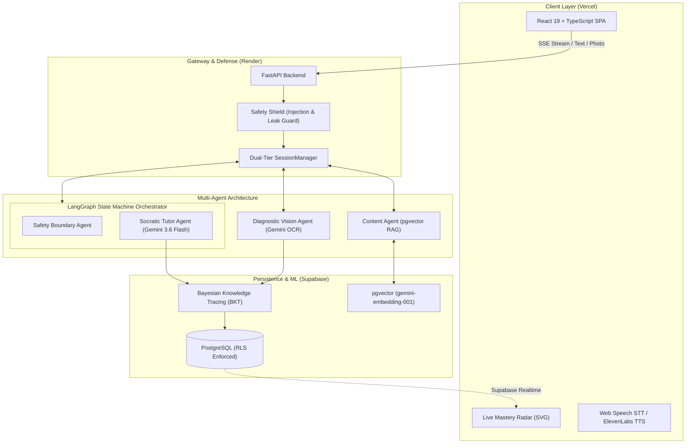

# Veritas — AI Socratic Math Tutor 🎓

> **Never gives away the answer.** Veritas diagnoses *why* a student's reasoning broke, pinpoints misconceptions on handwritten work with visual bounding boxes, and adapts what it teaches next using a calibrated **Bayesian Knowledge Tracing (BKT)** model.

[](https://fastapi.tiangolo.com/)
[](https://www.langchain.com/langgraph)
[](https://ai.google.dev/)
[](https://supabase.com/)
[](#machine-learning-pedagogical-engine)
[](#automated-validation-suite)

---

## 🎯 The Problem Veritas Solves

- **LLMs as "Cheat Machines"**: Generative AI tools (ChatGPT, Claude) default to dumping full calculations and final answers, bypassing the critical struggle where actual mathematical comprehension happens.
- **Multiple-Choice EdTech Blindness**: Traditional homework portals only record binary right/wrong answers without diagnosing *which* conceptual step failed or *why* the student believed their answer was right.
- **Parent & Teacher Disconnect**: Parents rarely know their child has a fraction gap until a failing test grade arrives weeks later.

### The Veritas Solution
Veritas delivers a private 1-on-1 human tutor experience:
1. **Strict Socratic Enforcement**: Multi-layered guardrails actively block answer leakage, guiding students with targeted probing questions.
2. **Handwritten Scratchpad Diagnosis**: Students upload camera photos of their handwritten math. Gemini 3.6 Flash detects the exact error step, generates visual bounding hints, and identifies the underlying misconception.
3. **Calibrated Student Mastery Model**: Updates per-skill mastery in real-time via Bayesian Knowledge Tracing calibrated against large-scale educational datasets.
4. **Live Parent Radar**: Parents track their child's curriculum competencies live with automated inactivity alerts.

---

## 🏗️ System Architecture



> **Multi-Agent Orchestration Note**: The Socratic Tutor and Safety-boundary agents are orchestrated via a compiled **LangGraph state machine** (`/session/message`), delivering state-driven dynamic routing, deterministic math evaluation, safety interception, and conversation history management. The Diagnostic Vision Agent (`/session/upload-work`) and Content Agent (`/session/next-problem`) are invoked directly for specialized multimodal vision breakdown and pgvector curriculum progression.

---

## 🧠 Machine Learning & Pedagogical Engine

### 1. Bayesian Knowledge Tracing (BKT)
Rather than simple streak counters, Veritas maintains a probabilistic cognitive model $P(L_t)$ tracking each student's latent mastery across 10 Common Core State Standards (CCSS):

$$\begin{aligned}
P(L_{t-1} \mid \text{Obs}) &= \begin{cases} 
\frac{P(L_{t-1})(1 - P(S))}{P(L_{t-1})(1 - P(S)) + (1 - P(L_{t-1}))P(G)} & \text{if correct} \\[8pt]
\frac{P(L_{t-1})P(S)}{P(L_{t-1})P(S) + (1 - P(L_{t-1}))(1 - P(G))} & \text{if incorrect}
\end{cases} \\[10pt]
P(L_t) &= P(L_{t-1} \mid \text{Obs}) + (1 - P(L_{t-1} \mid \text{Obs})) \cdot P(T)
\end{aligned}$$

- **Calibrated Parameters**: Fitted using bounded grid-search Maximum Likelihood Estimation (MLE) on a **70% train split**, with hyperparameter model selection and calibration loss minimization on a **15% validation split**, evaluated on a strictly held-out **15% test split** over educational interaction sequences from ASSISTments 2009-2010.
  - Student-level grouping: Train, validation, and test splits are strictly grouped by student ID using a seeded pseudo-random shuffle (`Random(42)`), guaranteeing zero cross-split interaction contamination.
  - 6 core skills calibrated over empirical interaction sequences; remaining 4 skills utilize Corbett & Anderson (1995) baseline cognitive tutor priors (registered in `backend/bkt/parameters.json`).
  - **Held-Out Predictive Evaluation**: Evaluated across **8,437** independent held-out student test observations:
    - Brier Score: Improved by **3.51%** MSE (**0.1923** calibrated vs **0.1993** uncalibrated baseline)
    - Log Loss: Improved by **4.41%** Cross-Entropy (**0.5746** calibrated vs **0.6011** uncalibrated baseline)
- **Pedagogical Observation Weighting**: Canonical BKT assumes binary unassisted observation sequences. To reflect real-world learning dynamics without inflating mastery, Veritas implements a pedagogical observation weighting model:
  - *Independent attempts* receive full Bayesian credit ($w = 1.0$).
  - *Hinted attempts* are scaled down ($w_{\text{hint}} = 0.5$) to account for tutor scaffolding.
  - *Corrections after feedback* are scaled down ($w_{\text{corrected}} = 0.4$) to reward mastery growth without over-crediting assisted answers.
  - Problem turn tracking tags student and tutor turns with `problem_id`, isolating attempt counts across problem transitions so first attempts on new problems are never misclassified as corrections.
- **Deterministic Math Grounding**: BKT updates are never entrusted to LLM judgment alone. A regex- and fraction-based deterministic math evaluator (`math_evaluator.py`) verifies student math solutions against canonical answers. It extracts answer-intent phrases, simplifies equivalent fractions and decimals via Python's `fractions.Fraction`, verifies algebraic equations and commutative addition expressions, and rejects negated numbers (`"isn't 12"`) or disjunctive alternative queries (`"is it 12 or 15?"`), overriding any hallucinated LLM correctness flags.

### 2. Multimodal Diagnostic Vision Agent
- **Visual Error Localization**: Inspects handwritten math work, extracts steps via OCR, and maps mistakes to research-backed misconception taxonomies (Eedi / NeurIPS 2020).
- **Bounding Reticle Integrity**: Returns normalized coordinate bounding boxes `[ymin, xmin, ymax, xmax]` highlighting the exact error location. If model localization is unavailable, it cleanly outputs `null` bounding hints with confidence 0.0, strictly avoiding synthetic or hallucinated box artifacts.
- **Evaluation & Integrity Testing**: Evaluated via dual-mode harness (`scripts/evaluate_vision.py`). Verified **100.0%** boundary clamping, zero synthetic coordinate leakage, and crash-free educational fallback resilience across boundary test conditions. Empirical OCR/misconception evaluation executes via `run_diagnostic_agent()` when real student handwriting datasets are provided.

### 3. Misconception-Targeted Adaptive RAG
- **Embedding Space**: Embeds student misconceptions and problem text using `models/gemini-embedding-001` (768 dimensions, centralized in `backend/config.py`).
- **Multi-Factor Adaptive Candidate Selection**: Candidates retrieved from pgvector (or resilient lexical token-overlap proxy on fallback) are ranked using a multi-factor composite pedagogical utility function:
  $$U(p) = 0.35 \cdot S_{\text{sim}} + 0.25 \cdot \text{Score}_{\text{misc}} + 0.20 \cdot \left(1 - \frac{|d_p - d_{\text{ZPD}}|}{3.0}\right) + 0.20 \cdot \left(1 - \frac{|d_p - d^*(P(L))|}{3.0}\right)$$
  balancing semantic/lexical similarity ($S_{\text{sim}}$), diagnosed error keyword targeting ($\text{Score}_{\text{misc}}$), discrete ZPD fit, and a mastery-derived pedagogical difficulty target $d^*(P(L)) = 1.0 + 4.0 \cdot P(L)$ (a heuristic mapping continuous mastery probability to curriculum difficulty levels 1–5, ensuring low-mastery students receive foundational scaffolding while advanced students receive consolidation challenges).
- **Longitudinal Misconception Tracking**: Student misconceptions are tracked across sessions and persisted to a local disk store (`misconceptions_store.json`), allowing pedagogical agents to retrieve student-specific persistent error patterns across restarts. Active misconceptions are resolved when the student independently solves subsequent problems targeting that skill.
- **Unrestricted Retrieval Benchmark** (`scripts/evaluate_retrieval.py` on 10 target diagnostic cases across an unrestricted pool of **208 problems** across all **10 CCSS skills**):
  - Candidate Pool Scope: **Unrestricted (all 208 problems / 10 standards)**
  - Top-1 Skill Precision: **90.0%** (9/10)
  - Top-1 Difficulty (ZPD) Fit: **100.0%** (10/10)
  - Misconception Keyword Coverage: **70.0%** (28/40)
  - Recall@1 (Target Remediation at Rank 1): **90.0%** (9/10)
  - Recall@3 (Target Remediation in Top 3): **100.0%** (10/10)
  - Recall@5 (Target Remediation in Top 5): **100.0%** (10/10)
  - Mean Reciprocal Rank (MRR): **0.9500**

### 4. Socratic Verifier & Safety Guardrails
- **Secondary Socratic Verifier**: Proactively instructs generated tutor dialogue (`backend/safety.py`) to prevent direct answer leakage, multi-step revelations, and non-Socratic statements.
- **Benchmark** (`scripts/evaluate_socratic.py`): **100.0%** detection accuracy on our internal 7-sample benchmark across adversarial direct answers, multi-step revelations, and Socratic guiding prompts.

### 5. Benchmark Performance Summary

| Evaluation Benchmark | Script / Harness | Scope & Dataset Size | Key Metric | Result |
|---|---|---|---|---|
| **BKT Predictive Accuracy** | `scripts/calibrate_bkt.py` | 8,437 held-out test observations (ASSISTments) | Held-Out Brier Score (MSE) | **-3.51%** (0.1923 vs 0.1993) |
| **BKT Log Loss** | `scripts/calibrate_bkt.py` | 8,437 held-out test observations (ASSISTments) | Held-Out Log Loss | **-4.41%** (0.5746 vs 0.6011) |
| **RAG Unrestricted Retrieval** | `scripts/evaluate_retrieval.py` | 10 diagnostic cases against unrestricted pool (208 problems) | Recall@1 / Recall@3 / MRR | **90%** / **100%** / **0.9500** |
| **RAG Top-1 Skill Precision** | `scripts/evaluate_retrieval.py` | Unrestricted 10-skill problem bank | Precision@1 (No skill filter) | **90.0%** (9/10 Skills) |
| **Vision Reticle & Fallback Integrity** | `scripts/evaluate_vision.py` | 10 structural & boundary test cases | Coordinate Clamping / Zero Leak / Resilient Fallback | **100%** Pass |
| **Socratic Answer Shield** | `scripts/evaluate_socratic.py` | Internal 7-sample adversarial benchmark | Adversarial Leakage Interception | **100%** Interception |
| **Curriculum Consistency** | `scripts/validate_curriculum_consistency.py` | 7 Game Levels, 10 BKT Skills, 208 Problems | End-to-End Curriculum Grounding | **100%** Verified |
| **Problem Bank Integrity** | `scripts/seed_db.py` | 208 curated problems | Canonical Solvability (10/10 Skills) | **100%** Solvable |

---

## 📚 Data Provenance & Open-Source Citations

Veritas leverages established academic benchmarks and open-source datasets to train, calibrate, and seed its pedagogical systems. In full compliance with academic integrity and open-source licenses:

| Resource / Dataset | License | Citation / Source | Role in Veritas |
|---|---|---|---|
| **GSM8K** (Grade School Math 8K) | **[MIT License](https://github.com/openai/grade-school-math/blob/master/LICENSE)** | OpenAI (Cobbe et al., *Training Verifiers to Solve Math Word Problems*, 2021) | **60 multi-step math word problems** imported via `scripts/expand_problem_bank.py`, re-tagged to CCSS Grade 3–5 skill standards, and structured with pedagogical reasoning steps in `data/seed_problems.json`. |
| **ASSISTments 2009–2010** | Open Academic / CAHLR | Worcester Polytechnic Institute (Heffernan et al.) | **Empirical BKT Calibration**: MLE parameter fitting ($P(L_0)$, $P(T)$, $P(G)$, $P(S)$) across 6 core skills over ~2.7M student interaction logs (`backend/bkt/parameters.json`). |
| **Eedi / NeurIPS 2020** | CC BY-NC-SA 4.0 | Eedi & Microsoft Research (Wang et al., *Diagnostic Questions*, 2020) | **Diagnostic Error Taxonomy**: Misconception classification ontology used by the Gemini Vision diagnostic agent to pinpoint root causes behind erroneous handwritten work. |
| **CCSS-M** | Public Domain | National Governors Association / CCSSO | **Curriculum Hierarchy**: Common Core State Standards for Grade 3–5 Mathematics structuring skill mastery ordering and progression. |

---

## ⚡ Core Features

| Feature | Description |
|---|---|
| 🎙️ **Voice-First Socratic Chat** | Low-latency streaming SSE dialogue with ElevenLabs TTS proxy and Web Speech STT. |
| 📸 **Scratchpad Work Vision** | Upload camera photos of handwritten calculations for step-by-step diagnostic breakdown. |
| 🛡️ **Anti-Leak Guardrails** | Secondary verification intercepts direct final answer reveals, redirecting to foundational questions. |
| 📊 **Real-Time Parent Radar** | 10-skill CCSS radar chart syncing live learning events via Supabase Realtime. |
| 💾 **Dual-Tier State Resilience** | Active sessions are cached in RAM (0ms) and backed by Supabase `sessions.state` JSONB + event streams (allowing state recovery across application-instance restarts; local disk acts as a development fallback). |
| 🔒 **Enterprise RLS Security** | Strict Supabase Row Level Security ensures parents cannot access another family's child records. |
| 🗑️ **Parental Data Deletion** | Self-serve "Delete Activity Data" control to immediately purge logs and session histories. |
| 🤖 **Neo Platform Assistant** | In-app contextual AI companion grounded to explain platform pedagogy and help parents navigate. |

---

## ✅ Automated Validation Suite

Veritas features an automated test runner verifying safety, RLS isolation, session survival, and multi-agent coordination.

> [!NOTE]
> **Local Test Suite vs. Deployment CI**: The `11/11 Passing` badge and validation suite below represent local comprehensive test runner execution (`python backend/run_all_tests.py`) covering all end-to-end multi-agent flows, database RLS isolation, deterministic math evaluation, and persistence tests. Deployment statuses on repository commits reflect Vercel frontend deployments and production container health checks.

Run the entire suite locally:
```bash
python backend/run_all_tests.py
```

### Live Test Suite Output
```text
============================================================================
   VERITAS AI SOCRATIC TUTOR — AUTOMATED VALIDATION SUITE
============================================================================

▶ Running Parent Role Authorization & Isolation (P0) (test_auth_p0_parent_isolation.py)...
  ✓ Parent Role Authorization & Isolation (P0) passed in 3.12s

▶ Running Deterministic Math Evaluator & Intent Parsing (test_math_evaluator.py)...
  ✓ Deterministic Math Evaluator & Intent Parsing passed in 0.07s

▶ Running Problem Turn Tracking & Attempt Isolation (test_problem_turn_tracking.py)...
  ✓ Problem Turn Tracking & Attempt Isolation passed in 4.12s

▶ Running Day-3 Resiliency & Session Persistence (test_session_persistence.py)...
  ✓ Day-3 Resiliency & Session Persistence passed in 6.65s

▶ Running Production RLS & Credential Isolation (test_production_rls.py)...
  ✓ Production RLS & Credential Isolation passed in 2.19s

▶ Running Platform Safety & Socratic Guardrails (test_safety.py)...
  ✓ Platform Safety & Socratic Guardrails passed in 0.51s

▶ Running Student Scoping, Rate Limiting & RAG Retrieval (test_auth_and_rag.py)...
  ✓ Student Scoping, Rate Limiting & RAG Retrieval passed in 5.62s

▶ Running Parent-Child Architecture & Inactivity Alerts (test_parent_child_flow.py)...
  ✓ Parent-Child Architecture & Inactivity Alerts passed in 18.17s

▶ Running Neo AI Platform Assistant & Guardrails (test_neo.py)...
  ✓ Neo AI Platform Assistant & Guardrails passed in 38.25s

▶ Running Session Resumption & Score Protection (test_session_and_score_fixes.py)...
  ✓ Session Resumption & Score Protection passed in 16.40s

▶ Running Math Arcade Games & Relogin Persistence (test_game_progress_persistence.py)...
  ✓ Math Arcade Games & Relogin Persistence passed in 12.42s

============================================================================
                     APPLICATION TEST EXECUTION SUMMARY                     
============================================================================
 #  | TEST SUITE                                      | STATUS     |    TIME
----------------------------------------------------------------------------
 1  | Parent Role Authorization & Isolation (P0)      | ✓ PASS     |   3.12s
 2  | Deterministic Math Evaluator & Intent Parsing   | ✓ PASS     |   0.07s
 3  | Problem Turn Tracking & Attempt Isolation       | ✓ PASS     |   4.12s
 4  | Day-3 Resiliency & Session Persistence          | ✓ PASS     |   6.65s
 5  | Production RLS & Credential Isolation           | ✓ PASS     |   2.19s
 6  | Platform Safety & Socratic Guardrails           | ✓ PASS     |   0.51s
 7  | Student Scoping, Rate Limiting & RAG Retrieval  | ✓ PASS     |   5.62s
 8  | Parent-Child Architecture & Inactivity Alerts   | ✓ PASS     |  18.17s
 9  | Neo AI Platform Assistant & Guardrails          | ✓ PASS     |  38.25s
 10 | Session Resumption & Score Protection           | ✓ PASS     |  16.40s
 11 | Math Arcade Games & Relogin Persistence         | ✓ PASS     |  12.42s
----------------------------------------------------------------------------
  ALL 11/11 TEST SUITES PASSED IN 107.53s!
  STATUS: ALL 11 APPLICATION TEST SUITES PASSED
============================================================================
```

---

## 🚀 Quickstart

### Prerequisites
- Python 3.11+
- Node.js 18+
- Supabase account with pgvector enabled
- Google Gemini API key

### 1. Clone & Setup
```bash
git clone https://github.com/Susil-commits/Veritas.git
cd Veritas

# Install Frontend dependencies
cd frontend && npm install && cd ..

# Setup Python Virtual Environment
cd backend
python -m venv venv
.\venv\Scripts\activate   # Windows
# source venv/bin/activate  # macOS/Linux
pip install -r requirements.txt
cd ..
```

### 2. Environment Configuration
Create `.env` in `backend/` and `frontend/`:
```env
# backend/.env
GEMINI_API_KEY=your_gemini_api_key
SUPABASE_URL=https://your-project.supabase.co
SUPABASE_ANON_KEY=your_supabase_anon_key
SUPABASE_SERVICE_ROLE_KEY=your_supabase_service_role_key
SUPABASE_JWT_SECRET=your_supabase_jwt_secret  # From Supabase Settings -> API -> JWT Settings
ELEVENLABS_API_KEY=your_elevenlabs_key  # Optional
```

```env
# frontend/.env
VITE_API_URL=http://localhost:8000
VITE_SUPABASE_URL=https://your-project.supabase.co
VITE_SUPABASE_ANON_KEY=your_supabase_anon_key
```

### 3. Database Migrations & Vector Seed
In your Supabase SQL Editor, run:
1. `scripts/setup_db.sql` (Tables, pgvector schema, RPCs)
2. `scripts/migration_day2_auth_children.sql` (Parent-child schema & strict RLS)
3. `scripts/migration_day3_session_state.sql` (Session state persistence)
4. `scripts/migration_day4_game_progress.sql` (Student game progress persistence)

Seed initial problem bank with Gemini embeddings:
```bash
python scripts/seed_db.py
```

### 4. Launch Locally
```bash
# Terminal 1 — Backend
cd backend
uvicorn main:app --reload --port 8000

# Terminal 2 — Frontend
cd frontend
npm run dev
```

---

## 📌 Known Limitations & Post-Hackathon Roadmap

- **Worker Concurrency & Distributed State**: In the current hackathon deployment, session state is managed via single-process asynchronous FastAPI workers backed by an in-memory cache with dual write-through to Supabase `sessions.state` JSONB / event tables and a persistent local disk cache (`sessions_store.json`). For horizontally autoscaled, multi-worker production environments behind a load balancer, session mutexes are roadmapped to distributed Redis locks (`Redlock`) with centralized Redis caching to ensure serialized turn processing across distinct worker instances.
- **Game Progress Distributed Persistence**: Game progress across arcade games (Space Math Explorer, Math Match Quest, Math Asteroids, Grid Runner) utilizes dual-tier persistence: reading and upserting directly to Supabase `public.student_game_progress` with Row Level Security (see `scripts/migration_day4_game_progress.sql`), with atomic local disk caching (`backend/data/games_store.json`) serving as a resilient offline/development fallback.
- **Dependency Security Patches**: Backend dependencies are pinned to versions current as of initial build; a full security-patch upgrade is planned post-hackathon. (`python-multipart` has been patched to `0.0.32` to protect public multipart upload parsing).
- **Curriculum Scope**: Current problem bank targets 10 core Common Core State Standards (CCSS) in elementary mathematics, architected to expand to middle and high school standards.


